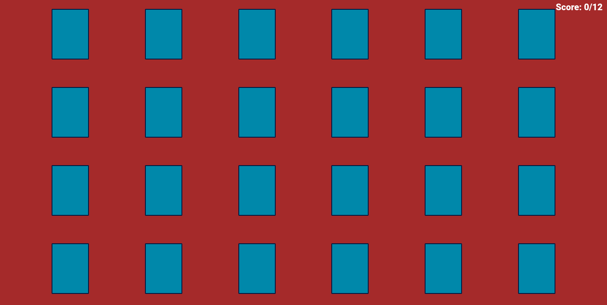
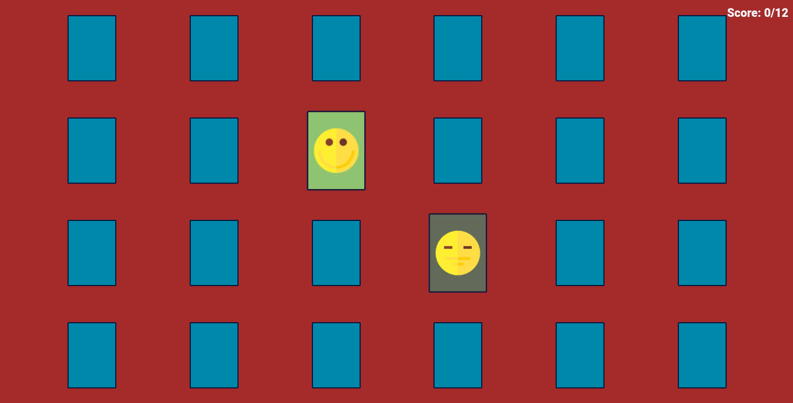

# Memory Game

A basic card game with Javascript.

## Screenshots


You can create custom cards in the ```src/MyDeck.js```




## Lessons Learned
This game is very simple, In the future update I want to add new functionality. I'm learning more about Javascript. So I used classes in this project to learn JS Classes.